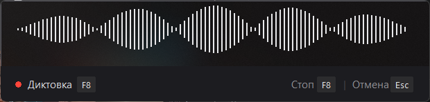
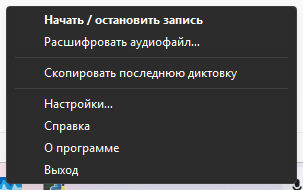

# Dictum

*[English version →](README.md)*

**Речь в текст на своём компьютере.** Две вещи в одной программе:

🎤 **Диктовка.** Нажал клавишу — говоришь — текст появляется в том окне, где
стоял курсор. В любом окне Windows, где можно печатать: письма, заметки,
сообщения, запросы к нейросетям.

📄 **Расшифровка записей.** Выбрал в меню аудиофайл — рядом с ним лёг текст.
Голосовое из мессенджера, диктофонная запись совещания, лекция. Час записи
разбирается примерно за восемь минут, ограничения на длину нет.



*Пока говоришь, внизу экрана висит капсула: по волне видно, что микрофон слышит,
а рядом подписаны клавиши остановки и отмены.*

Всё происходит на своём компьютере. Аккаунт, подписка и оплата не нужны; после
установки не нужен даже интернет — ни звук, ни текст никуда не отправляются.

Русскую речь распознаёт **GigaAM v3** от Сбера: сама расставляет запятые и точки,
пишет «13:15» вместо «тринадцать пятнадцать». В меню переключается на
многоязычную модель — казахский, киргизский, узбекский. Знаки препинания для неё
ставит отдельный модуль, так что казахский текст тоже выходит читаемым, а не
сплошным потоком.

**Только для Windows** (10 и 11). На macOS и Linux не запустится.

---

## Установка

Устанавливать нечего: Python и библиотеки уже внутри. Программа не прописывается
в систему, не пишет в реестр и не требует прав администратора — её можно положить
куда угодно, унести на флешке и удалить одним нажатием.

Три сборки на выбор — одна и та же программа, разница только в том, что уже
лежит внутри.

### 1. Один файл (60 МБ)

Скачать `dictum.exe`, запустить. **Первый запуск занимает несколько минут** —
программа скачивает модель распознавания, 216 МБ. Внизу экрана появится полоска
«первый запуск: качаю модель». Ждать. Модель ляжет в папку `models` рядом с exe,
и больше этого не повторится: дальше запуск занимает секунды.

### 2. Переносная папка (архив 222 МБ)

Скачать `dictum-portable.zip`, распаковать, запустить `dictum.exe` изнутри.
Модель уже лежит внутри — **скачивать нечего, интернет не нужен ни разу**.
Годится для машины без сети, с медленным или платным интернетом, и для флешки.

Распаковывать **не в Program Files**: программе нужно право записи рядом с собой.
Рабочий стол, «Документы» или флешка подойдут.

### 3. Переносная папка с казахским (архив 599 МБ)

Скачать `dictum-portable-kazahskiy.zip`. То же, что вторая, плюс многоязычная
модель и знаки препинания к ней: казахский, киргизский, узбекский. Многоязычная
модель выбрана заранее, диктовать можно сразу.

Русская модель внутри тоже лежит — переключиться на неё можно в меню значка,
скачивать ничего не придётся.

Архив большой, потому что внутри три набора весов вместо одного. Если интернет
есть, проще взять `dictum.exe` и добавить казахский из меню — программа скачает
недостающее сама.

### Синее окно при запуске

Windows покажет «Система Windows защитила ваш компьютер». Нажать ссылку
**«Подробнее»**, под ней появится кнопка **«Выполнить в любом случае»**. Так
Windows встречает любую программу, которую видит впервые.

### Проверка антивирусами

Файл из релиза проверен на VirusTotal — это семьдесят антивирусов сразу:

**[3 находки из 69 →](https://www.virustotal.com/gui/file/9fd8bbec99633bbda88d3e04cd66c5469965ea72ae973345e030c90c1731128e/detection)**
— Bkav, Zillya и Microsoft. Kaspersky, ESET, Avast и Dr.Web претензий не имеют.

**В версии 1.1.3 находок было две, и Microsoft среди них не было.** Скрывать это
незачем, но объяснить стоит, потому что причина известна.

Вердикт Microsoft — `Program:Win32/Wacapew.C!ml`. Приписка `!ml` означает
«машинное обучение»: не совпадение с известным вирусом, а решение обученной
модели, что файл похож на подозрительные. Семейства `Wacapew` и `Wacatac`
печально известны тем, что срабатывают почти на любую программу, собранную
упаковщиком PyInstaller. Причина не в конкретной программе, а в самом
упаковщике: его загрузочный модуль одинаков у всех, и им пользуются в том числе
авторы вредоносного кода — сходство наследуется вместе с ним.

**Что изменилось в 1.2.0 и почему сработало сильнее.** В сборку добавились знаки
препинания для казахского: разметочная модель через ONNX и разбивщик текста
`sentencepiece` со своей библиотекой машинного кода. Плюс два модуля программы.
Чем больше машинного кода внутри упаковщика, тем охотнее эвристика считает файл
подозрительным — и это верно для любой программы, а не только для этой.

Перехват клавиатуры тут настоящий и тоже добавляет подозрений: без него горячая
клавиша не работала бы. Он описан выше открытым текстом.

**Проверено на живой машине:** Defender с включённой защитой в реальном времени
и свежими базами просканировал этот файл целиком и не тронул его — программа
работает. Срабатывание видно в облачной проверке VirusTotal, где Defender
работает в более строгом режиме.

Что с этим делают вообще: подписывают файл сертификатом разработчика — это
единственное настоящее решение, оно стоит денег и требует юридического лица.
Пока подписи нет, остаются исходники рядом и этот отчёт. Программа собирается из
кода, который лежит в этом же репозитории, и любой может собрать её сам —
команда сборки описана ниже.

Ниже на той же странице есть разделы с правилами сообщества — YARA и Sigma. Это
не антивирусы, на счёт находок они не влияют, и красная пометка HIGH там значит
не то, что кажется. Одно правило просто опознаёт упаковщик и само оговаривает,
что совпадение не означает вредоносности. Второе срабатывает на загрузку
библиотеки `vcruntime140.dll` не из системной папки, третье — на любое создание
исполняемого файла. Оба про одно: однофайловая сборка при каждом запуске
распаковывает свои 228 библиотек во временную папку и грузит их оттуда. Признак
настоящий, умысла нет — по-другому один-единственный exe не устроить. Упоминание
APT29 в описании правила объясняет, чем такой приём опасен вообще, а не говорит
что-то про эту программу.

Отчёт привязан к содержимому файла, а не к чьей-то загрузке. Отпечаток релиза
`v1.2.0` — один и тот же exe лежит и отдельным файлом, и внутри обоих архивов.
Сверить у себя можно командой в PowerShell:

```powershell
Get-FileHash .\dictum.exe -Algorithm SHA256
# 9FD8BBEC99633BBDA88D3E04CD66C5469965EA72AE973345E030C90C1731128E
```

Не сошлось — значит файл не из релиза, запускать не стоит.

Проверить свою сборку той же командой: `python release_check.py dist\dictum.exe`.

Окна после запуска не появится — программа живёт **значком рядом с часами**. Он
может прятаться под стрелочкой «Отображать скрытые значки».

---

## Как пользоваться

| Действие | Что происходит |
|---|---|
| **F8** | начать запись — внизу экрана всплывает полоска с волной, видно, что микрофон слышит |
| **F8** ещё раз | распознать и вставить текст туда, где стоял курсор |
| **Esc** | выбросить запись, ничего не распознавая |
| левый клик по значку | то же, что F8 |
| правый клик по значку | настройки |

Текст вставляется в то окно, которое было активным **в момент начала записи**.
Поэтому перед нажатием F8 нужно поставить курсор туда, где должен появиться
текст.

Дольше двух минут за раз программа записывать не станет — остановится сама. Это
предохранитель на случай, если забыл выключить.

### Куда диктовать не получится

**В окна, запущенные от имени администратора, обычная программа печатать не
может.** Это не поломка Dictum и не обходится настройкой — так устроена защита
Windows: она не пропускает нажатия клавиш от обычной программы к привилегированной.
Иначе любая программа могла бы подсматривать ввод и подсовывать команды в
системные окна.

Выглядит это так: в Блокноте всё работает, а в окне администратора F8 не
срабатывает вовсе — ни записи, ни полоски внизу экрана.

Каких окон касается: Диспетчер задач, редактор реестра, командная строка и
PowerShell, запущенные от администратора, установщики программ, а на рабочих
компьютерах — часто ещё антивирусы и средства удалённой поддержки.

**Лечится одним способом: запустить саму диктовку от администратора** — правый
клик по `dictum.exe` → «Запуск от имени администратора». Тогда она печатает и в
такие окна.

Чтобы не повторять каждый раз, можно сделать ярлык (правый клик по exe →
«Создать ярлык»), в его свойствах открыть «Дополнительно» и поставить галочку
«Запуск от имени администратора». Windows будет спрашивать подтверждение при
каждом старте — это неизбежно, отключается только ослаблением защиты всей
системы.

Обратной проблемы нет: программа с правами администратора печатает и в обычные
окна тоже. Ограничение работает в одну сторону — снизу вверх.

---

## Расшифровка готовых записей

Не диктовка вживую, а разбор того, что уже записано: голосовое из мессенджера,
диктофонная запись совещания, лекция.

**Правый клик по значку у часов → «Расшифровать аудиофайл…»** — откроется
обычное окно выбора, можно отметить сразу несколько записей.

> **Перетащить файл на значок у часов нельзя.** Область уведомлений Windows
> файлы не принимает — ни у одной программы, такой возможности в системе просто
> нет. Перетаскивать можно **на сам файл `dictum.exe`** или на его ярлык: это
> работает, но значок у часов для этого не годится. Если перетаскивание не нужно,
> пользуйся меню — способ равноценный.

Пока идёт разбор, внизу экрана видно, сколько сделано. По готовности текст
ложится **рядом с записью**, тем же именем и расширением `.txt`, и сразу
открывается. Файл с таким именем уже есть — новый получит номер: чужой текст не
затирается никогда.

### Какие файлы читаются

`.wav` · `.mp3` · `.ogg` · `.opus` · `.flac` · `.aiff` · `.caf` — то есть
голосовые из Telegram и WhatsApp, обычные записи с диктофона и с компьютера.

**`.m4a` не читается** — на этом формате записывает «Диктофон» на iPhone и часть
андроидов. Его нужно сначала перевести в MP3 или WAV любым конвертером.
Звук из видео тоже не берётся.

### Сколько это занимает

Ограничения на длину нет: и час, и три часа разберутся. Скорость — примерно в
восемь раз быстрее реального времени, ровно, без замедления на длинных записях.

| Длина записи | Сколько ждать |
|---|---|
| 2 минуты | ~15 секунд |
| 10 минут | ~1,5 минуты |
| 30 минут | ~4 минуты |
| 1 час | ~8 минут |

Пока идёт расшифровка, диктовка по клавише не работает — это одна и та же модель,
и делить её между двумя делами нельзя.

### Почему текст разбит на абзацы

Длинную запись программа режет по паузам: модель обучена на кусках до полуминуты
и на длинном куске молча теряет часть текста. Замер на трёхминутной записи: без
нарезки — 164 слова, с нарезкой — 275. Ошибки при этом никакой не видно, просто
сорок процентов текста не появляется.

Абзац начинается там, где в записи была пауза длиннее двух секунд.

---

## Настройки

Всё живёт в одном меню — правый клик по значку у часов:



- **Язык и модель** — переключение между тремя моделями. Незнакомая скачается
  сама, выбор запомнится. Не подошла — вернуться тем же меню.
- **Сохранять записи на диск** — по умолчанию выключено. Включённым кладёт каждую
  диктовку в папку `data/dictation` двумя файлами, звук и текст. Нужно, только
  чтобы сравнить две модели на одной записи; копится ~2 МБ на минуту речи.
- **Горячая клавиша** — нажать пункт, затем нажать желаемую клавишу. Esc —
  оставить прежнюю.
- **Язык программы** — русский или казахский. Меняется сразу, перезапуск не нужен.
- **Словарь замен** — файл `Замены.txt` рядом с программой: слева услышанное,
  справа нужное. Пригодится для имён, фамилий и английских названий, которые
  модель пишет кириллицей.
- **Справка** — то же, что этот раздел, только внутри программы: разделы слева,
  текст справа.
- **О программе** — окно с моделью, клавишей и версией.

Выбранное сохраняется в файле `.env` рядом с программой и переживает перезапуск.

### Какую модель выбрать

| Модель | Языки | Знаки препинания | Размер |
|---|---|---|---|
| `gigaam-v3-e2e-rnnt` | русский | своими силами | 216 МБ |
| `gigaam-multilingual-ctc` | русский, казахский, киргизский, узбекский | модулем | 225 МБ |
| `gigaam-multilingual-large-ctc` | те же четыре, точнее на живой речи | модулем | 592 МБ |

Разница по знакам препинания — не мелочь, а разные семейства моделей. Русская
обучена выдавать готовый текст: с запятыми, точками и заглавными буквами.
Многоязычная выдаёт поток букв строчными — в её словаре 70 символов, и ни точки,
ни запятой среди них нет.

Поэтому знаки для неё ставит **отдельный модуль**: 233 МБ, работает на процессоре
за десятые доли секунды, слов не меняет. Он ставит их в русском, казахском и
киргизском; узбекского не знает — узбекская речь остаётся без знаков.

Как хорошо он это делает по-казахски — 206 фраз из набора FLEURS: границы
предложений находит в 95 случаях из 100, запятые примерно в двух третях,
заглавные буквы в 97 % слов. Подробности замера — [docs/kazahskiy-modul.md](docs/kazahskiy-modul.md).

Модуль скачивается пунктом меню или кладётся папкой в `models/` — второе работает
на машине без интернета вовсе.

Диктуешь по-русски — первая модель. Нужен казахский — вторая.

---

## Как это работает

```
   микрофон  →  запись в памяти  →  модель  →  текст  →  буфер обмена  →  окно
   (F8)         числа, 16000          распознаёт        Ctrl+V туда,
                замеров в секунду     речь              где был курсор
```

1. **Запись.** Нажатие F8 открывает микрофон. Звук — не «файл», а поток чисел:
   16 000 замеров громкости в секунду. Они копятся в памяти.
2. **Распознавание.** Второе нажатие закрывает микрофон и отдаёт накопленные
   числа модели. Та превращает их в слова и расставляет знаки препинания.
3. **Вставка.** Готовый текст кладётся в буфер обмена, программа возвращает фокус
   нужному окну и нажимает Ctrl+V за тебя. Прежнее содержимое буфера через
   секунду возвращается на место.

У расшифровки файлов путь короче, но с лишним шагом посередине:

```
   файл  →  привести к 16 кГц  →  нарезать по паузам  →  модель  →  текст рядом
            телефон пишет 44,1     куски до 25 секунд              с записью, .txt
```

Нарезка — не ускорение, а условие правильности: на длинном куске модель молча
теряет часть текста, подробности выше в разделе про абзацы.

Модель **только слышит слова**. Она не понимает смысла и ничего не додумывает:
скажешь «удали файл» — напишет «удали файл».

Рядом с программой появляются папки `models` (веса модели), `logs` (журнал) и
файл `.env` (настройки).

---

## Если что-то не работает

**Значка у часов нет, клавиша молчит.** Программа не запустилась. Если она
падает на старте, то сама покажет окно с ошибкой и назовёт файл журнала. Если
окна не было — открыть `logs/dictum.log` рядом с exe: первым делом там записана
обстановка (версия, папка, система, свободное место, какие модели на месте), а
дальше — что происходило и на чём всё встало.

Журнал можно открыть из программы: правый клик по значку → **«Показать журнал»**.
Этот файл и нужно прислать, если разобраться не выходит.

**«Программа уже запущена» — а её нет.** Значок у часов может прятаться под
стрелочкой «Отображать скрытые значки»: проверить там. Если значка нет и в
скрытых, посмотреть в журнале строку про порт: программа держит номер 47811 как
замок от второго запуска, и если его занял кто-то другой, в журнале будет сказано
прямо. Запуску это больше не мешает — перестанет работать только перетаскивание
файлов, расшифровка останется в меню.

**Клавиша не срабатывает нигде.** Её мог занять кто-то другой — особенно на
ноутбуках, где F-клавиши отданы под яркость и громкость. Сменить в меню значка.

**Клавиша работает в одних окнах, но не в других.** Скорее всего, молчащее окно
запущено от имени администратора. Проверяется за минуту: нажать клавишу в
Блокноте, потом в Диспетчере задач (Ctrl+Shift+Esc). Работает в первом и молчит
во втором — это оно, и лечится оно запуском самой диктовки от администратора.
Подробно — выше, «Куда диктовать не получится».

**Микрофон не найден.** Проверить, что он выбран основным в настройках звука
Windows.

**Распознаёт медленно.** Скорость зависит от процессора; ориентир — несколько
секунд на минуту речи. Первое распознавание после запуска всегда дольше
остальных.

**Текст вставился не туда.** За время диктовки переключились в другое окно —
текст ушёл в него. Программа возвращает фокус тому окну, которое было активным на
старте записи.

**Файл не расшифровывается, программа говорит «не читается».** Формат не из
списка — чаще всего это `.m4a` с iPhone. Перевести в MP3 любым конвертером.

**Перетащил файл на значок у часов, ничего не произошло.** Так и будет: область
уведомлений Windows файлы не принимает ни у одной программы. Пользуйся меню
значка либо перетаскивай на сам `dictum.exe`.

**Во время расшифровки не работает клавиша диктовки.** Так и задумано: модель
одна, и делить её между двумя делами нельзя. Дождаться конца — внизу экрана видно,
сколько сделано.

---

## Из исходников

```powershell
python -m venv .venv
.\.venv\Scripts\python.exe -m pip install -r requirements.txt
.\.venv\Scripts\python.exe voice_input.py --check   # проверить микрофон и модель
.\.venv\Scripts\pythonw.exe voice_input.py          # запуск
.\.venv\Scripts\python.exe -m pytest                # тесты
.\.venv\Scripts\python.exe build_exe.py             # собрать exe
.\.venv\Scripts\python.exe build_exe.py --portable  # ещё и переносной архив
.\.venv\Scripts\python.exe release_check.py dist\dictum.exe   # проверка на VirusTotal
```

`release_check.py` спрашивает VirusTotal об отпечатке собранного файла и печатает
вердикты движков. Загрузка спрятана за отдельный флаг `--upload`: файл остаётся у
них навсегда, и необратимое действие не должно случаться от простого запуска.
Ключ читается из переменной окружения `VT_API_KEY`.

| Файл | За что отвечает |
|---|---|
| `voice_input.py` | Главное: микрофон, распознавание, вставка текста, значок в лотке, горячая клавиша |
| `transcribe.py` | Расшифровка готовых файлов: чтение звука, нарезка по паузам, склейка абзацев |
| `voice_window.py` | Только рисование капсулы с волной; про распознавание не знает ничего |
| `voice_settings.py` | Чтение и запись `.env`: меню меняет одну строку, не портя остальные |
| `build_exe.py` | Сборка exe |

Разбор решений — в папке [docs/](docs/).

---

## Автор и лицензии

Dictum написал **Gshin-droid**. Исходники открыты:
<https://github.com/Gshin-droid/dictum>

Код — MIT: пользоваться, менять и раздавать можно свободно, в том числе в
платных продуктах. Единственное условие — сохранять файл `LICENSE` с указанием
авторства. Гарантий никаких: программа поставляется как есть.

Модель GigaAM разработана Сбером, лицензия MIT. Библиотека запуска —
[onnx-asr](https://github.com/istupakov/onnx-asr) Ильи Ступакова, тоже MIT. Ни
модель, ни библиотека в этот репозиторий не входят: модель скачивается при первом
запуске, библиотека ставится из `requirements.txt`.
